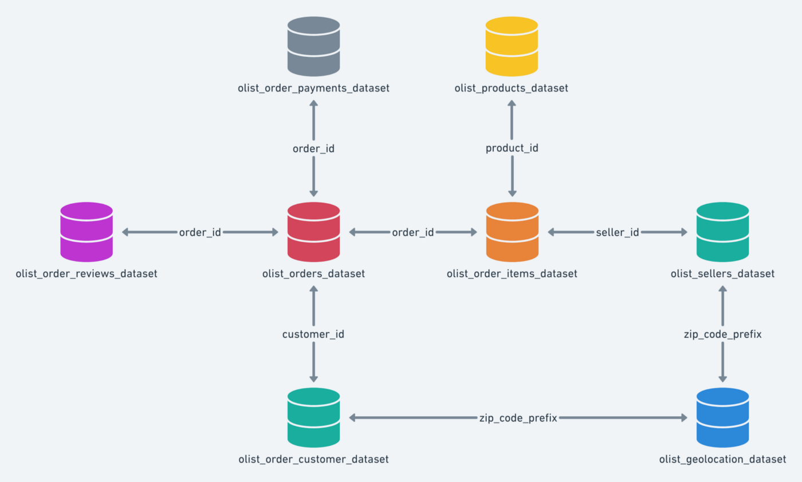

# Extracting Information from the Brazilian E-Commerce Database by Olist in SQL
This repository contains practices with the SQL language in the Brazilian E-Commerce Dataset by Olist, to retrieve data to fulfill some requests. There are 4 practice notebooks, a data folder, and a images folder. The Olist database is stored in my local desktop and connected to Jupyter Notebook.

## Introduction
Brazilian E-Commerce Public Dataset by Olist is a dataset with information from 100,000 orders from 2016 to 2018 placed on various marketplaces in Brazil.   

Its features allow you to view an order from multiple dimensions: from order status, price, payment and shipping performance to customer location, product attributes and, reviews written by customers, as well as a geolocation dataset that relates Brazilian zip codes to latitude and longitude coordinates.

## The Database
### Data source
1. [Brazilian E-Commerce Public Dataset by Olist](https://www.kaggle.com/olistbr/brazilian-ecommerce)
2. [Marketing Funnel by Olist](https://www.kaggle.com/olistbr/marketing-funnel-olist/home)

### Informations to keep in mind   
1. The order placed can include several items.   
   Ana ordered 1 box of apples, 1 box of grapes, and 1 box of strawberries.
2. Each item can have a different seller.    
   Peter sells apples, Patricia sells grapes, and Igor sells strawberries.
3. Customers state is their shipping address state, and one customer can have different ones.

### How the data is organized

## Requests
### Practice 1  
1. Select data from the payment table where only the payment types "voucher" and "boleto" appear.   
2. Return only reviews that have no comments.     
3. Return orders that were made in the year 2017 only.    
4. Find customers from the state of SP and who do not live in the city of São Paulo.

### Practice 2  
1. Return the number of items sold in each category by the state the customer is in, showing only categories that have sold items quantity above 1000. 
2. Show the 5 customers (customer_id) who spent the most money on purchases, what was the total value of all their purchases, the number of purchases, and the average amount spent per purchase. Sort them in descending order by average purchase amount.     
3. Show the total sales value of each seller (seller_id) in each of the product categories, only returning the sellers that in this sum and grouping sold more than $1000. We want to see the product categories that are not null and the sellers. For each of these categories, show their sales values in descending order.    

### Practice 3  
1. Create an analytical table of all items that have been sold, showing only interstate orders. We want to know how many days the vendors take to post the product, and whether or not the product arrived on time.   
2. Return all the customer's payments, with their approval dates, purchase amount, and the total amount the customer has already spent on all purchases, showing only those customers where the purchase amount is different from the total amount already spent.     
3. Return the valid categories, their total sums of sales values, a ranking from highest value to lowest value along with the accumulated sum of values by the same rule as the ranking.    

### Practice 4  
1. Create a view (SELLER_STATS) to show per supplier, the quantity of items shipped, the average postage time after purchase approval, the total quantity of orders for each supplier.   
2. We want to give a coupon for 10% of the customer's last purchase. However, customers eligible for this coupon must have made a purchase prior to the last purchase (as of the order approval date) that was greater than or equal to the last purchase. Create a query that returns the coupon amounts for each of the eligible customers.
